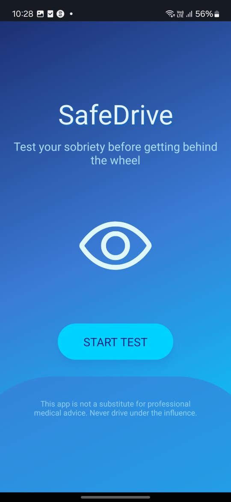
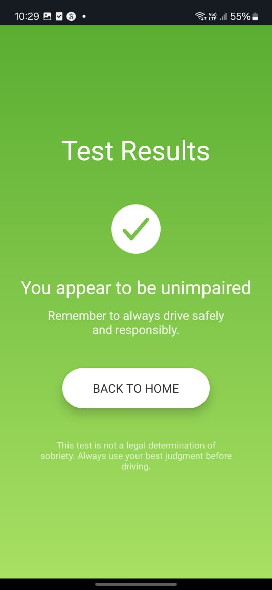
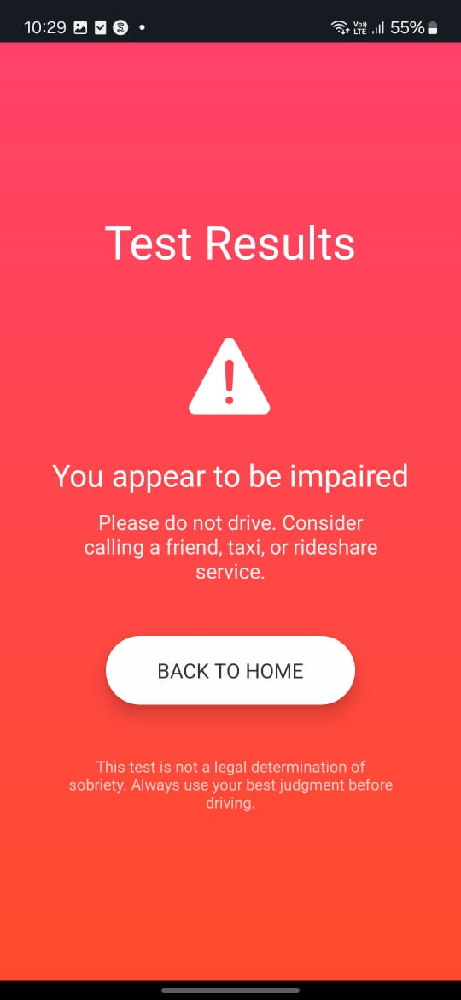

# BlinkShield

BlinkShield is a mobile app that uses your smartphone’s front-facing camera to perform a fast, AI-powered Horizontal Gaze Nystagmus (HGN) test. Designed to help users self-assess impairment before driving, the test takes less than 30 seconds and provides private, accurate feedback without storing any personal data.

---

## 📄 Project Presentation

[Download the BlinkShield Project Presentation (PDF)](docs/BlinkShield.pdf)

---

## Mobile UI Screenshots

Below are screenshots showcasing the mobile user interface of the application:










## 🚀 What It Does

BlinkShield presents a moving dot on the screen, which the user follows with their eyes. While this happens, the front-facing camera records a video. This video is then analyzed by an AI backend to detect signs of:

- Erratic eye motion
- Involuntary movements (nystagmus)
- Irregular tracking behavior

If impairment is detected, the app privately informs the user — all within seconds.

---

## 🛠️ How We Built It

### Frontend
- **Framework**: React Native + Expo
- **Functionality**: Displays a moving dot and records video using the front-facing camera.

### Video Capture
- Duration: 30-second video captured during dot tracking
- Purpose: To analyze eye motion during HGN-style test

### Backend
- **Framework**: FastAPI
- **AI Analysis**: Uses **Gemini API** for advanced video-based vision intelligence
- **Data Privacy**: No video is stored. It is discarded after inference.

---

## 🤖 AI-Powered Detection

- **Gemini API**:
  - Handles pattern recognition and motion tracking
  - Offloads compute from mobile to a hosted model
  - More accurate and reliable than on-device OpenCV/MediaPipe

---

## 🔐 Privacy by Design

- **No storage of video**
- **Only used for analysis in-memory**
- **No personal data required or retained**

---

## ⚙️ Technologies Used

- `React Native`
- `Expo`
- `FastAPI`
- `Gemini API`
- `Python`
- `JavaScript / TypeScript`
- `HTML / CSS`
- `Next.js`
- `ngrok`

---

## 🧩 Challenges Faced

- Transitioning from local models (OpenCV, MediaPipe) to cloud-based Gemini API
- Synchronizing dot movement with video frame capture
- Sending video input reliably to an API typically used for image analysis
- Frontend-backend timing coordination for smooth user experience

---

## ✅ Accomplishments

- End-to-end implementation of an HGN test using only a phone
- Seamless integration of cloud-based AI for real-time analysis
- Fast, private, and reliable assessment in under 30 seconds
- Maintained smooth UX across multiple tech stacks

---

## 📚 What We Learned

- Using Gemini API for real-time video pattern detection
- Comparing trade-offs between local and cloud CV models
- Building time-synced tests in React Native
- Managing secure, temporary video pipelines for medical-style assessments

---

## 🔮 What’s Next

- **Eye coloration analysis** using OpenCV/MediaPipe for detecting redness or fatigue
- **Vehicle integration** — prevent car ignition if user fails the test
- **Multi-signal analysis** — combine movement + color indicators

---

## 💡 Inspiration

>In India, drunk driving remains a critical road safety issue, contributing significantly to the country's high accident rates. In 2022, India recorded 461,312 road accidents, resulting in 153,972 deaths, with drunk driving alone accounting for 10,080 accidents, 4,201 fatalities, and 8,809 injuries, as reported by Policy Circle and LinkedIn. Additionally, a survey by the Community Against Drunken Driving (CADD) in Delhi found that 81.2% of 30,000 respondents admitted to driving under the influence, highlighting the widespread nature of this behavior (NDTV, The Times of India). These alarming statistics emphasize the urgent need for innovative solutions like AI-powered tools to assess and prevent impaired driving, potentially saving thousands of lives annually.
---


## 🧪 Run Locally

```bash
# Frontend
cd frontend
npm install
npm start

# Backend
cd backend
pip install -r requirements.txt
uvicorn main:app --reload
